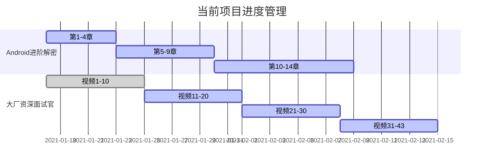

##  21/1/25-21/1/31

### 1.日常打卡

- [x] 一道算法题（114/1763） 
- [x] 7点10起床
- [x] 下周的计划安排
- [x] 本周计划总结

### 2. 进行中学习系列计划

- [ ] 《算法》第四版（future）
- [ ] 玩Android每日一题（future）
- [ ] Android开发高手课 （低优先级）
- [ ] Android内核剖析（future）
- [x] 大厂资深面试官 带你破解Android高级面试（3/43）
- [x] Android进阶解密（60/471）
- [x] 算法训练营第二章 完成
- [ ] Android进阶之光 （future）
- [ ] 设计模式之美 （future）
- [ ] Java核心技术面试精讲-杨晓峰 （future）

### 3.文章整理计划

- [ ] UI优化的几个关键点（50%）

- [ ] Kotlin中协程的使用

- [ ] Activity的文章总结

- [ ] Android的Binder机制总结

### 4. 已完成的系列集合

- Android开发艺术与探索

- 极客时间经典算法40讲

- 数据结构与算法之美

  

### 5. 本周总结

1. 每周的总结单独开章没有必要，所以在这周将计划和总结进行合并，顺便标题改成数字吧，每次看文章列表不是按顺序的就很难受，那就从20周开始吧，从0开始。

2. 上周引入了新的时间管理工具小番茄，目前看来使用效果还不错，加强了自己对时间的管控能力。

   - 但是注意每日的任务清理分配，尤其工作日和休息日可能存在较大的差异，需要进行适当的调整。
   - 发现他有一个任务统计的功能，每周可以加上任务完成度等
   - 对于之前并行业务的拆分，但是推动起来被算法开销覆盖了，这块需要仔细再想想。

3. 这两周的大部分精力都花在算法训练营上，感觉很痛苦，时间开销有点大，但是效果也比较明显，像是突破了某个瓶颈，对于前面自学的东西有了快速推进的能力。

   - 算法的复盘和复习上，现在问题是中等和简单的LeetCode还好，能迅速推演和掌握，但是困难的题目，经常会出现思路没有问题但是提交代码的时候测试用例无法通过，这方面需要进行改善。
   - 关于算法和数据结构，要加强学习笔记，作为后面复习的资料
   - 同一题目反复做，避免出现做完就忘

4. 两周时间发现了问题很多，尤其是一些文章和重点研究过的东西，变得很模糊，这周开始无论什么都是需要用笔记进行记录，并利用记忆曲线来帮助自己进行记忆，学习的速度从慢到快。

5. Android的书本学习的进度有点落下了，这周加强时间上的管控，保证这三个高优先级的项目能同时推进，按计划完成。

   