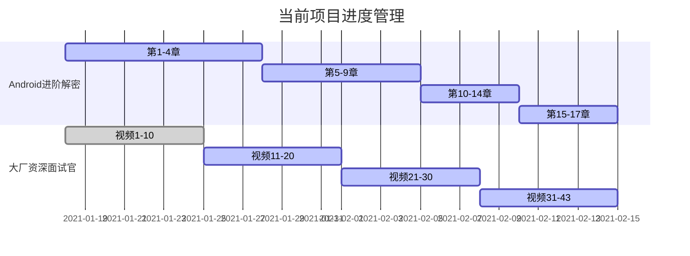

##  21/2/1-21/2/7

### 1.日常打卡

- [x] 一道算法题（127/1763） 
- [x] 7点10起床
- [x] 下周的计划安排
- [x] 本周计划总结

### 2. 进行中学习系列计划

- [ ] 《算法》第四版（future）
- [ ] 玩Android每日一题（future）
- [ ] Android开发高手课 （低优先级）
- [ ] Android内核剖析（future）
- [ ] 复旦大学公开课——资本论B站（来自哲学王子，听了一点觉得很有意思）
- [x] 大厂资深面试官 带你破解Android高级面试（13/43）
- [x] Android进阶解密（60/471）
- [x] 算法训练营第三周 （3/7）
- [ ] Android进阶之光 （future）
- [ ] 设计模式之美 （future）
- [ ] Java核心技术面试精讲-杨晓峰 （future）

### 3.文章整理计划

- [ ] UI优化的几个关键点
- [ ] Kotlin中协程的使用
- [ ] Activity的文章总结
- [ ] Android的Binder机制总结
- [x] Android进阶解密读书笔记（2/17）
- [x] 大厂面试官学习笔记(30%)
- [x] 算法学习笔记——模板代码和常见问题(3/7)

### 4. 已完成的系列集合

- Android开发艺术与探索

- 极客时间经典算法40讲

- 数据结构与算法之美

  

### 5. 本周总结

1. 源码解析很枯燥，如果一个任务是分析一个步骤的话，那么就不能停下来，必须一鼓作气一天把他拿下，放到第二天完成的欲望虽然还有，但是动力减少了很多，所以关于任务，要么就不开始，一旦开始必定要将他完成，宁可推迟开启任务，也不可将任务完成一半，否则作为每日任务就失去意义了。
2. 本周复盘新增了任务完成度，为了这个玩意儿还特意买了小番茄的VIP，ps：不是vip无法查看历史记录，鼓励下作者，希望能出多些分析维度，方便我复盘整理。
3. 发现了B站的资本论——哲学王子讲得，挺有意思的，准备换完工作进行一波学习。
4. 计划切割按每日计划来的，偷懒了两天发现延期了好多任务。积少成多，回顾一下本周的事情，聊天和游戏耗费了不少时间，周四了赶紧控制一下，卸载游戏，关闭聊天，周四任务清理完成。