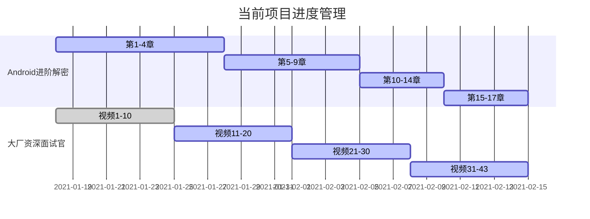

##  21/2/8-21/2/14

### 1.日常打卡

- [x] 一道算法题（132/1763） 
- [x] 7点10起床
- [x] 下周的计划安排
- [x] 本周计划总结

### 2. 进行中学习系列计划

- [ ] 《算法》第四版（future）
- [ ] 玩Android每日一题（future）
- [ ] Android开发高手课 （低优先级）
- [ ] Android内核剖析（future）
- [ ] 复旦大学公开课——资本论B站（来自哲学王子，听了一点觉得很有意思）
- [x] 大厂资深面试官 带你破解Android高级面试（13/43）
- [x] Android进阶解密（60/471）
- [x] 算法训练营第4周 （4/7）
- [ ] Android进阶之光 （future）
- [ ] 设计模式之美 （future）
- [ ] Java核心技术面试精讲-杨晓峰 （future）

### 3.文章整理计划

- [ ] UI优化的几个关键点
- [ ] Kotlin中协程的使用
- [ ] Activity的文章总结
- [ ] Android的Binder机制总结
- [x] Android进阶解密读书笔记（2/17）
- [x] 大厂面试官学习笔记(30%)
- [x] 算法学习笔记——模板代码和常见问题(3/7)

### 4. 已完成的系列集合

- Android开发艺术与探索

- 极客时间经典算法40讲

- 数据结构与算法之美

  

### 5. 本周总结

1. 过年了，本周开始逐步将算法的时间比重下降了，把之前需要的进阶解密和大厂面试官进一步完成，争取三周之内，全部完成。
2. 本周真是堕落的一周。诶，卸载app关闭手机重新开始

