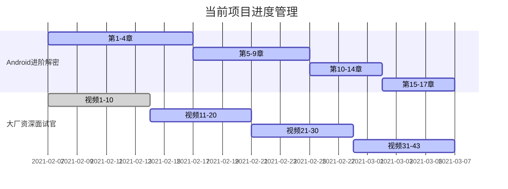

##  21/2/21-21/2/28

### 1.日常打卡

- [x] 一道算法题（167/1763） 
- [x] 7点10起床
- [x] 下周的计划安排
- [x] 本周计划总结

### 2. 进行中学习系列计划

- [ ] 《算法》第四版（future）
- [ ] 玩Android每日一题（future）
- [ ] Android开发高手课 （低优先级）
- [ ] Android内核剖析（future）
- [ ] 复旦大学公开课——资本论B站（来自哲学王子，听了一点觉得很有意思）
- [x] 大厂资深面试官 带你破解Android高级面试（16/43）
- [x] Android进阶解密（71/471）
- [x] 算法训练营第6周 （6/7）
- [ ] Android进阶之光 （future）
- [ ] 设计模式之美 （future）
- [ ] Java核心技术面试精讲-杨晓峰 （future）

### 3.文章整理计划

- [ ] UI优化的几个关键点
- [ ] Kotlin中协程的使用
- [ ] Activity的文章总结
- [ ] Android的Binder机制总结
- [x] Android进阶解密读书笔记（3/17）
- [x] 大厂面试官学习笔记(35%)
- [x] 算法学习笔记——模板代码和常见问题(6/7)

### 4. 已完成的系列集合

- Android开发艺术与探索

- 极客时间经典算法40讲

- 数据结构与算法之美

  

### 5. 本周总结

1. 本周在牛客网上，找了一上午的面经，选了几个感觉难度比较符合的面经，准备在最后阶段冲刺的时候进行准备。
2. 上周共完成计划60个，比上周同步增长不少，时间利用率上去了，可以继续增加力度，和专注度。
3. 算法训练营的最后一周，本周所有的算法强度训练需要结束。告一段落，面经里的算法题，为主。
4. 正月过去了，预计大部分公司都要回归正轨了，最后阶段准备复习Android 相关知识，抓紧时间复习。

