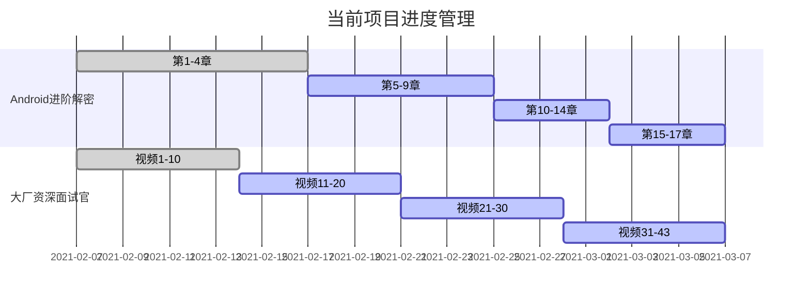

##  21/3/1-21/3/7

### 1.日常打卡

- [x] 一道算法题（leetcode 181 牛客网 2） 
- [x] 7点10起床
- [x] 下周的计划安排
- [x] 本周计划总结

### 2. 进行中学习系列计划

- [ ] 《算法》第四版（future）
- [ ] Android开发高手课 （future）
- [ ] Android内核剖析（future）
- [ ] 透视HTTP协议 (t1)
- [x] 网络协议集训班（t0）
- [ ] 复旦大学公开课——资本论B站（来自哲学王子，听了一点觉得很有意思）
- [x] 大厂资深面试官 带你破解Android高级面试（16/43）（t0）
- [x] Android进阶解密（165/471）（t0）
- [x] LeetCode 剑指offer 练习题（6/67）（t0）
- [ ] Android进阶之光 （future）
- [ ] 设计模式之美 （future）
- [ ] Java核心技术面试精讲-杨晓峰 （future）

### 3.文章整理计划

- [ ] UI优化的几个关键点
- [ ] Kotlin中协程的使用
- [ ] Android的Binder机制总结
- [x] Android进阶解密读书笔记（4/17）
- [x] 大厂面试官学习笔记(35%)

  

### 4. 已完成的系列集合

- Android开发艺术与探索

- 极客时间经典算法40讲

- 数据结构与算法之美

- 极客时间——算法训练营

  

### 5. 本周总结

1. 本周又采购了一堆教材，系统性的或复习或学习，提高水平。
2. 本周终于结束了算法训练营，至此，学完三个主要算法的三个课程，算是对算法基本入门了，暂时可以放缓一下，后续需要的时候再进入深入的研究。
3. 整理下复习路线吧
   1. 网络相关（透视HTTP协议，共计36章，目前进行中的两个大项结束后，开始）
   2. Android 部分（进阶和面试笔记为主）
   3. 算法和数据结构（数据结构以笔记和王争的课为主，算法以习题为主）
   4. Java 部分（量大，不太好掌握，以之前面试经验来看，线程安全较多，基础数据结构和3相似）
   5. 面经收尾
4. 看书属实有点枯燥，以后看不进去就直接看视频，两个方向同时进去，对于算法怎么保持手感，还得再思考一下

