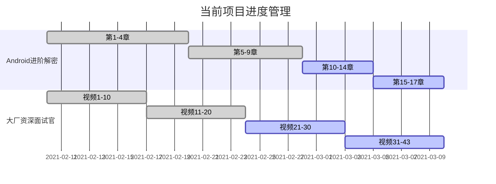

##  21/3/15-21/3/21

### 1.日常打卡

- [x] 一道算法题（leetcode 181 牛客网 4） 
- [x] 7点10起床
- [x] 下周的计划安排
- [x] 本周计划总结

### 2. 进行中学习系列计划

- [ ] 《算法》第四版（future）
- [ ] Android开发高手课 （future）
- [ ] Android内核剖析（future）
- [ ] 透视HTTP协议 (t1)
- [x] 网络协议集训班（t0）
- [ ] 复旦大学公开课——资本论B站（来自哲学王子，听了一点觉得很有意思）
- [x] 大厂资深面试官 带你破解Android高级面试（16/43）（t0）
- [x] Android进阶解密（267/471）（t0）
- [ ] Android进阶之光 （future）
- [ ] 设计模式之美 （future）
- [ ] Java核心技术面试精讲-杨晓峰 （future）

### 3.文章整理计划

- [ ] UI优化的几个关键点
- [ ] Kotlin中协程的使用
- [ ] Android的Binder机制总结
- [x] Android进阶解密读书笔记（9/17）
- [x] 大厂面试官学习笔记(35%)

  

### 4. 已完成的系列集合

- Android开发艺术与探索

- 极客时间经典算法40讲

- 数据结构与算法之美

- 极客时间——算法训练营

  

### 5. 本周总结

1. 下周重点推进以下网络协议集训班
2. 复习一下算法
3. 结束解密和面试课程

