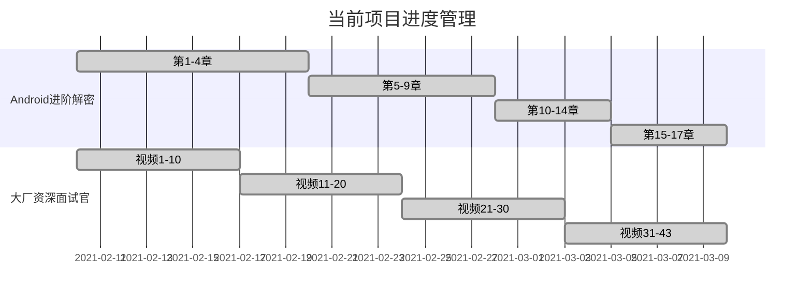

##  21/3/29-21/4/11

### 1.日常打卡

- [x] 一道算法题（leetcode 188 牛客网 4） 
- [x] 7点10起床
- [x] 下周的计划安排
- [x] 本周计划总结

### 2. 进行中学习系列计划

- [ ] 《算法》第四版（future）
- [ ] Android开发高手课 （future）
- [ ] Android内核剖析（future）
- [ ] 透视HTTP协议 (t1)
- [ ] 复旦大学公开课——资本论B站（来自哲学王子，听了一点觉得很有意思）
- [ ] Android进阶之光 （future）
- [ ] 设计模式之美 （future）
- [ ] Java核心技术面试精讲-杨晓峰 （future）

### 3.文章整理计划

- [ ] UI优化的几个关键点
- [ ] Kotlin中协程的使用
- [ ] Android的Binder机制总结

### 4. 已完成的系列集合

- Android开发艺术与探索
- 极客时间经典算法40讲
- 数据结构与算法之美
- 极客时间——算法训练营
- 大厂面试官系列
- 网络协议集训班
- Android进阶解密

### 5. 本周总结

1. 两周都是准备面试相关的额，学习计划就暂停了，找好工作后，继续开始学习计划
2. 现在是计划复习阶段，将面试常见知识点整理完成，全文2w多字，后面复习的时候还是会做些调整。
3. 下周主要就是先找几家规模不大的公司，面试一下找一下状态，顺便动动嘴熟悉下常见面试题。
4. 大厂面试官的课程顺利收官，最后几节课都是套路视频没啥营养
5. 进行中学习计划已经完成，下周开始进行简历投递和面试过程。

