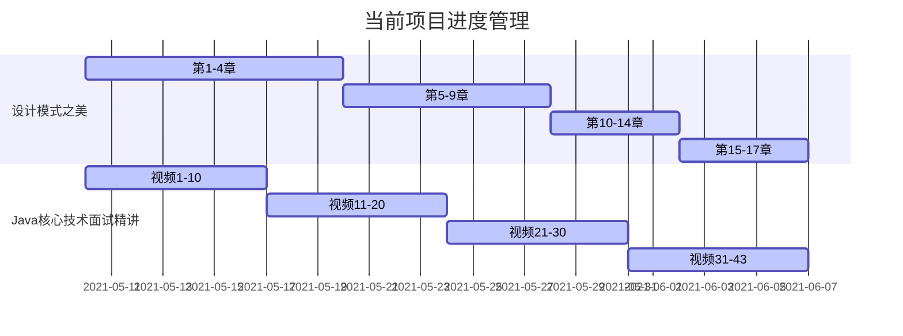

##  21/4/12-21/4/18

### 1.日常打卡

- [x] 一道算法题（leetcode 196 牛客网 4） 
- [x] 7点10起床
- [x] 下周的计划安排
- [x] 本周计划总结

### 2. 进行中学习系列计划

- [ ] 《算法》第四版（future）
- [ ] Android开发高手课 （future）
- [ ] Android内核剖析（future）
- [ ] 透视HTTP协议 (t1)
- [ ] 复旦大学公开课——资本论B站（来自哲学王子，听了一点觉得很有意思）
- [ ] Android进阶之光 （future）
- [x] 设计模式之美 
- [x] Java核心技术面试精讲-杨晓峰

### 3.文章整理计划

- [ ] UI优化的几个关键点
- [ ] Kotlin中协程的使用
- [x] SurfaceFlinger进程相关的知识总结（done）

### 4. 已完成的系列集合

- Android开发艺术与探索
- 极客时间经典算法40讲
- 数据结构与算法之美
- 极客时间——算法训练营
- 大厂面试官系列
- 网络协议集训班
- Android进阶解密

### 5. 本周总结

1. 上周梳理完成的2.3w字的常见面试题总结，这周还在继续完善，目前已经扩容到2.5w字，下周将继续结合最近三个月的面试题，将之前的面试答案总结一下。
2. 本周通过高爷Systrace系列的文章，结合张绍文的Android开发高手课，终于将SurfaceFlinger搞明白了，后面抽时间将这个系列的文章浓缩一个学习笔记出来。
3. 下周的面试安排以中大型公司为主了，不在小公司上浪费精力了
4. 顺便接了一个外包项目，下周二将开始开发外包项目。
5. 大厂面试官的课程顺利收官，最后几节课都是套路视频没啥营养
6. 进行中学习计划已经完成，下周开始进行简历投递和面试过程。

