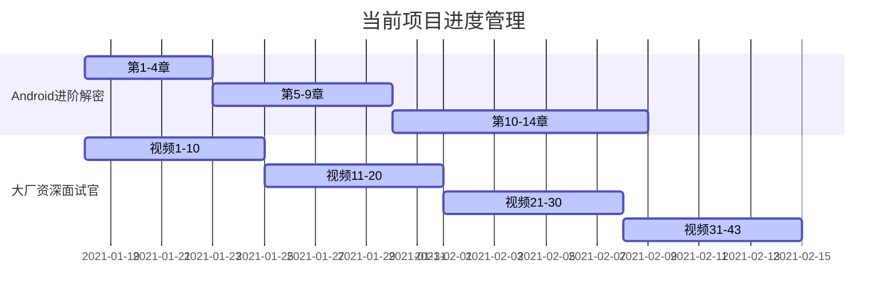

##  20/1/18-20/1/24

### 1.日常打卡

- [x] 一道算法题（95/1763） 
- [x] 7点20起床
- [x] 下周的计划安排
- [x] 本周计划总结

### 2. 进行中学习系列计划

- [ ] 《算法》第四版（完成进度 195/651）

- [ ] 玩Android每日一题（9/118）

- [ ] Android开发高手课 （2/63）

- [ ] Android内核剖析（99/626）

- [x] 大厂资深面试官 带你破解Android高级面试（3/43）

- [x] Android进阶解密（60/471）

- [ ] Android进阶之光

- [ ] 设计模式之美

- [ ] Java核心技术面试精讲-杨晓峰

### 3.文章整理计划

- [ ] UI优化的几个关键点（50%）

- [ ] Kotlin中协程的使用

- [ ] Activity的文章总结

- [ ] Android的Binder机制总结

### 4. 已完成的系列集合

- Android开发艺术与探索

- 极客时间经典算法40讲

- 数据结构与算法之美

  